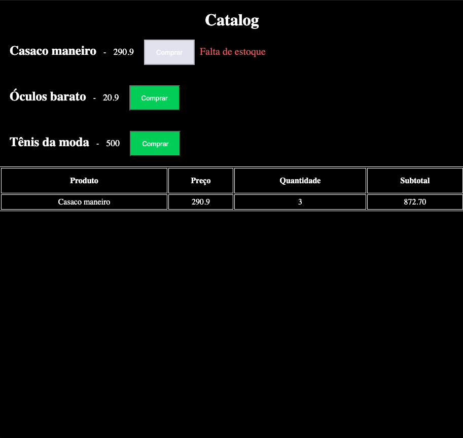

<h1 align="center">
   Catalogo de produtos com Redux Saga 
    </h1>
</p>

Projeto voltado para o aprendizado de Redux com Redux Saga.

<br/>

## 🚀 Tecnologias

- [React](https://reactjs.org)
- [TypeScript](https://www.typescriptlang.org/)
- [Node.js](https://nodejs.org/en/)
- [Redux](https://redux.js.org/)
- [Redux Saga](https://redux-saga.js.org/)

## Instalações e usos

Clone ou faça o downlod desse repositório:

```
# Clone o repositório
$ git clone https://github.com/rafaelone/Cart-Redux-Saga
```

Acesse a pasta web e faça as instalações:

```
# Acesse a pasta do frontend
$ cd Cart-Redux-Saga/

# Instale as dependencias
$ npm install | yarn

# Rode
$ npm start | yarn start
$ npm run server | yarn run server

```

👤 **Rafael Sergio**

- Github: [Rafael Sergio](https://github.com/rafaelone/)
- Linkedin: [Rafael Sergio](https://www.linkedin.com/in/rafael-sergio-982951103/)
